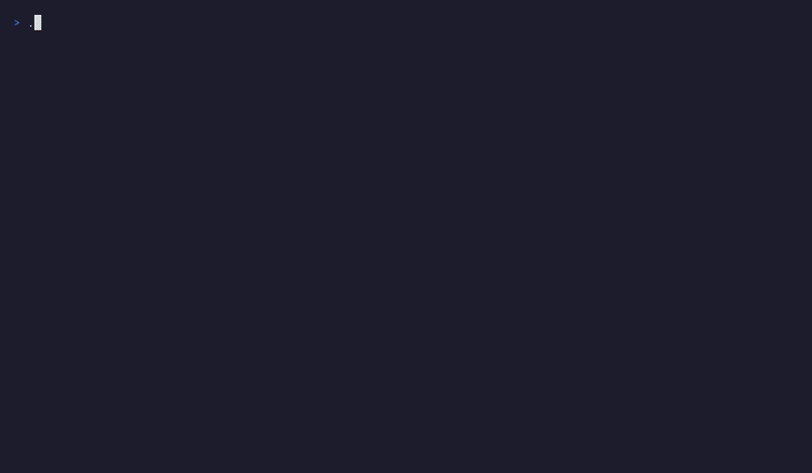

# golearn

```text
   ██████╗  ██████╗ ██╗     ███████╗ █████╗ ██████╗ ███╗   ██╗
  ██╔════╝ ██╔═══██╗██║     ██╔════╝██╔══██╗██╔══██╗████╗  ██║
  ██║  ███╗██║   ██║██║     █████╗  ███████║██████╔╝██╔██╗ ██║
  ██║   ██║██║   ██║██║     ██╔══╝  ██╔══██║██╔══██╗██║╚██╗██║
  ╚██████╔╝╚██████╔╝███████╗███████╗██║  ██║██║  ██║██║ ╚████║
   ╚═════╝  ╚═════╝ ╚══════╝╚══════╝╚═╝  ╚═╝╚═╝  ╚═╝╚═╝  ╚═══╝
                adaptive learning in your terminal
```

**Practise multiple-choice questions in your terminal. Fully offline,
deterministic, and yours. No account, no cloud, no lock-in.**

[](https://github.com/dezeat/golearn/actions/workflows/ci.yml)
[](https://go.dev)
[](LICENSE)

golearn turns YAML/JSON question packs into a fast, stats-aware practice
session in a Bubble Tea TUI. Everything lives in a local SQLite file — there is
no network path by design, so your progress never leaves the machine.



> The animation above is generated from [`assets/demo.tape`](assets/demo.tape)
> with [charmbracelet/vhs](https://github.com/charmbracelet/vhs) — a
> deterministic, re-runnable recording over a throwaway demo database. To
> re-render it, see [`assets/README.md`](assets/README.md).

---

## Why golearn?

- **Local-first and fully offline.** Questions, sessions, and stats live in one
  SQLite file under `~/.golearn`. No account, no telemetry, no network calls —
  the offline guarantee is architectural, not a setting.
- **Deterministic by design.** Same data in → byte-identical output. Selection
  shuffles use a seeded PRNG, content hashing is stable, and export ordering is
  reproducible, so packs round-trip cleanly through version control.
- **Performance-aware practice.** Selection modes prioritise unseen questions
  and your weakest areas, so a session spends time where it helps most.
- **Multi-user local profiles.** Several people share the same local data;
  sessions and stats are scoped per profile.
- **Human-readable packs, zero lock-in.** A simple YAML/JSON schema you can
  diff and review, plus import/export that keeps your content portable.
- **CGo-free single binary.** Built on `modernc.org/sqlite`, so it
  cross-compiles to a static binary with no C toolchain.

## Install

```bash
go install github.com/dezeat/golearn/cmd/golearn@latest
```

The binary lands in your `$GOPATH/bin` (or `$GOBIN`). Requires **Go 1.25+**.

Prefer a prebuilt binary? Each tagged release ships archives for Linux, macOS,
and Windows (amd64 + arm64), published by GoReleaser on the
[releases page](https://github.com/dezeat/golearn/releases).

## Quickstart

```bash
# Import a bundled question pack
golearn import packs/go-basics.yaml

# Launch the interactive TUI
golearn tui

# Or run a quick text-mode session
golearn run go-basics --n 5

# Export a topic back to a portable pack file
golearn export go-basics --out backup.yaml

# Reset the database (deletes all local data)
golearn db reset --yes
```

Building from source instead of `go install`? `make build` compiles to
`./bin/golearn`.

## The practice loop (TUI)

```bash
golearn tui
```

A single interactive surface takes you from profile to summary:

- **Profile select** — pick or create a local profile; stats are per-user.
- **Topic select** — browse topics with question counts and accuracy.
- **Session config** — choose how many questions and which selection mode
  (Balanced, Random, By Difficulty, Weakest).
- **Question screen** — navigate choices with ↑/↓, toggle with Space, submit
  with Enter; skip with `S`.
- **Quiz-show review** — colour-coded ✔/✘ feedback; press `E` to reveal the
  explanation for each choice.
- **Summary** — accuracy, average response time, and a jump into the questions
  you missed with `R`.
- **Stats dashboard** — global accuracy, per-pack breakdowns, difficulty
  distribution, weakest questions, and trends.

## Selection modes

golearn does not just shuffle. Each session is built by a selection policy:

| Mode          | What it does                                                   |
|---------------|----------------------------------------------------------------|
| Balanced      | Default. Unseen questions first, then weak, then random fill.  |
| Random        | Full shuffle of the topic; ignores your stats.                 |
| By Difficulty | Filter to `easy`/`medium`/`hard`, then Balanced within it.     |
| Weakest       | Target your lowest-accuracy tag or worst-performing questions. |

Every shuffle is seeded, so a given set of inputs always produces the same
session — practice is reproducible, not random-feeling.

## Import

```bash
# Import a single file
golearn import packs/go-basics.yaml

# Import every pack in a directory
golearn import packs/

# Use a custom database path
golearn --db /tmp/test.db import packs/go-basics.yaml
```

Import is **all-or-nothing per file**: every question is validated before
anything is inserted, and a single bad question rejects the whole file with an
actionable error naming the file, question index, and field:

```
packs/bad.yaml: question[2].choices: must have >= 2 choices, got 1
```

Duplicate content is skipped automatically — a stable content hash is the
dedup key, so re-importing the same pack inserts nothing new.

## Export

```bash
# Export a topic to YAML
golearn export go-basics --out pack.yaml

# Export to JSON
golearn export llm-agents --out pack.json --format json

# Re-import the exported file — zero duplicates
golearn import pack.yaml
```

Export ordering is deterministic (stable column plus a content-hash tie-break),
so exported packs are byte-stable and diff cleanly across runs.

## Question pack format

Packs are YAML or JSON files designed to be readable and version-controlled:

```yaml
pack_version: "0.1.0"
topic:
  slug: "go-basics"
  name: "Go Basics"
questions:
  - type: "single_select"
    intro: "Go's `defer` statement schedules calls for function return."
    prompt: "When does a deferred function call execute in Go?"
    choices:
      - { id: "1", text: "Immediately when the defer statement is reached" }
      - { id: "2", text: "When the surrounding function returns" }
      - { id: "3", text: "When the program exits" }
      - { id: "4", text: "At the end of the current block scope" }
    correct_choice_ids: ["2"]
    tags: ["defer", "control-flow"]
    difficulty: easy
    rationale:
      correct: "Deferred calls execute when the surrounding function returns, in LIFO order."
      per_choice:
        1: "Arguments are evaluated immediately, but the call is deferred."
        2: "Deferred calls run on function return in reverse order (LIFO)."
        3: "Defers are function-scoped, not program-scoped."
        4: "Go's defer is function-scoped, not block-scoped."
```

Explanations are stored content-only — no "Correct:" prefixes or emoji.
Presentation (labels `A`/`B`/`C`, correctness markers) is added at render time.
See [`docs/architecture.md`](docs/architecture.md) for the full schema,
validation rules, and hashing recipe.

## Bundled packs

| Pack                     | Questions | Description                                       |
|--------------------------|-----------|---------------------------------------------------|
| `packs/go-basics.yaml`   | 15        | Go language fundamentals with full rationale      |
| `packs/llm-agents.yaml`  | 15        | LLM agents & agentic AI for curious non-engineers |

```bash
# Or pull a community pack repo and import the whole directory
git clone https://github.com/dezeat/golearn-packs.git
golearn import golearn-packs/packs/
```

## Architecture

golearn is a hexagonal (ports & adapters) Go project: a pure `domain` core,
`ports` interfaces, `app` use cases, swappable `adapters`, and a `cmd`
composition root that wires them together. Dependencies point inward only.


```
cmd/golearn/              CLI entrypoint + composition root
internal/
  domain/                 Pure domain types, validation, hashing
  ports/                  Interfaces (repositories, pack source)
  app/                    Use cases (import, export, session, selection)
  adapters/
    sqlite/               SQLite persistence + migrations (WAL, CGo-free)
    pack/                 YAML/JSON pack reader
    localconfig/          Local user profile config
    tui/                  Bubble Tea terminal UI
packs/                    Bundled question packs
```

The full spec — data model, validation, hashing, selection policy, and
determinism guarantees — lives in [`docs/architecture.md`](docs/architecture.md).

## Configuration

| Flag   | Default                 | Description             |
|--------|-------------------------|-------------------------|
| `--db` | `~/.golearn/golearn.db` | Path to SQLite database |

`--db` is a global flag parsed before the subcommand, e.g.
`golearn --db /tmp/test.db import packs/`.

## Development

```bash
make build      # compile to ./bin/golearn
make test       # run all tests
make fmt        # check gofmt formatting
make vet        # go vet
make lint       # golangci-lint (if installed)
make check      # fmt + vet + lint + test (CI gate)
make db-reset   # delete the default database
make clean      # remove build artifacts
```

Requirements: **Go 1.25+** for `go install` or building from source; optionally
`golangci-lint` for `make lint`.

## Roadmap

**Mid-term**

- LLM/RAG-assisted draft question generation
- Assisted pack validation and quality checks
- Minimal but scalable webserver with an HTMX web UI

**Long-term**

- Collaborative repository for shared pack publishing and discovery

## Your data never leaves your machine

There is **no network path by design**. golearn reads and writes exactly one
place — a local SQLite file under `~/.golearn` — and talks to nothing else. No
account, no sync, no telemetry, no analytics. Import and export keep your
content in plain, diffable YAML/JSON, so you are never locked in: your
questions and your stats are files you own, on hardware you control.

## License

[Apache 2.0](LICENSE)
