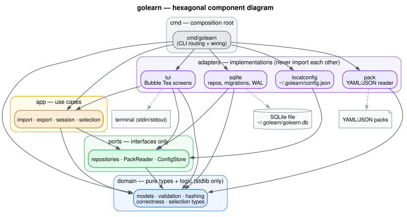
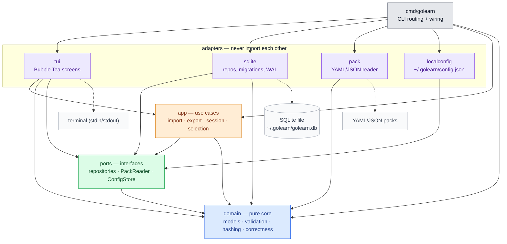

# golearn — Architecture

The committed technical spec: what golearn is, how it is layered, and the data
and behaviour contracts that layout enforces. This file describes what is true
**now**. It is project _facts_; _how to operate_ (workflow, PM, branching) lives
in `AGENTS.md`, and _why_ a fact is the way it is lives in `docs/DECISIONS.md`
(cross-referenced inline as `(D-00N)`). When this file and `AGENTS.md` disagree
on a project fact, this file wins.

## Purpose

golearn is a local-first terminal application for practising multiple-choice
questions (MCQs), aimed at certification prep and technology learning.
Questions are imported from YAML/JSON pack files, stored in SQLite, and
practised through an interactive Bubble Tea TUI with per-user stats, multiple
selection modes, and deterministic export. The `golearn` binary is fully
offline by design — it has no network path — and CGo-free, so it
cross-compiles to a static binary with no C toolchain (D-001).

The offline law is **binary-scoped** (D-015). A second binary,
`golearn-forge`, adds opt-in question authoring and is the only one that ever
reaches the network, and then only while authoring. See
[Authoring boundary](#authoring-boundary).

Runtime dependencies of the core module are deliberately few: `bubbletea`,
`lipgloss`, `gopkg.in/yaml.v3`, and `modernc.org/sqlite`. Adding one is a
design change, and `internal/boundary` fails the gate if the set drifts.

## Architecture diagram

C4-style component view of the four hexagonal layers plus the composition root.
Every edge is a real import confirmed with `go list` — dependencies point inward
only, and no adapter imports another adapter. The Mermaid source below renders
natively on github.com; a rendered `assets/architecture.svg` (Graphviz, offline)
and its `assets/architecture.dot` source are committed alongside it.





Regenerate the SVG after editing the diagram (see `assets/README.md`):

```bash
dot -Tsvg assets/architecture.dot -o assets/architecture.svg
```

## Hexagonal layout

golearn is a ports & adapters (hexagonal) Go project under `internal/`, with a
`cmd/golearn` entrypoint. The layering is law (D-002): dependencies point
inward, and the arrows below are the only ones allowed.

```
domain/     Pure types and logic. stdlib only; zero internal imports.
ports/      Interfaces only (driven + driving). No implementations, no adapters.
app/        Use cases. Depends on domain + ports. Never on adapters.
adapters/   Implementations (sqlite, pack, tui, localconfig). Depend on
            ports + domain — never on each other.
cmd/        Composition root. Wires adapters to ports; the only package that
            knows about all the others.
```

An adapter importing another adapter (e.g. `tui` importing `sqlite`) is an
architecture violation. All dependency injection happens in the composition
root, `cmd/golearn/main.go`.

### Package map

- `internal/domain/` — `models.go` (Topic, Question, Choice, Session, Attempt,
  Pack), `validation.go` (the 8 rules), `hashing.go` (stable SHA-256 +
  normalisation), `correctness.go` (order-insensitive answer evaluation),
  `explanation.go` (prefix strip/format helpers), `choice_label.go`
  (`DisplayLabelForIndex`).
- `internal/ports/` — `repositories.go` (`TopicRepo`, `QuestionRepo`,
  `SessionRepo`, `AttemptRepo`, `StatsRepo`, `ConfigStore`, user repo) and
  `sources.go` (`PackReader`).
- `internal/app/` — `import_pack.go`, `export_pack.go`, `session.go` (session
  engine), `selector.go` + `selection_mode.go` + `selector_difficulty.go` +
  `selector_weakest.go` (selection policy), `resolve_user.go`,
  `user_context.go`.
- `internal/adapters/` — `sqlite/` (repos, sequential migrations, WAL, reset),
  `pack/` (YAML + JSON parsing, directory support), `tui/` (Bubble Tea screens,
  keymap, layout), `localconfig/` (`~/.golearn/config.json`).
- `packs/` — embedded example packs via `go:embed` (`go-basics.yaml`,
  `llm-agents.yaml`) for first-run bootstrap.
- `internal/boundary/` — test-only. Executable guards for D-015: no HTTP
  client in the core binary, exactly four direct runtime dependencies, no
  first-party network imports, and no core package importing the addon.
- `cmd/golearn/main.go` — CLI routing and composition root.
- `addons/forge/` — the authoring addon, a **separate Go module** with its own
  `go.mod`. Owns every provider SDK, HTTP client and retrieval dependency.
  Contains `cmd/golearn-forge/` (its composition root) and
  `internal/config/` (non-secret configuration reporting).

## Authoring boundary

`golearn-forge` is golearn plus assisted question generation (D-015, epic
#66). It exists as a second binary from a nested module so that the offline
product carries none of generation's dependencies.

**Module topology.**

- The root module stays the Core module at exactly four runtime dependencies,
  CGo-free.
- `addons/forge` is a nested module at import path
  `github.com/dezeat/golearn/addons/forge`. Because Go grants `internal/`
  access on import-path prefix rather than module identity, Forge imports core
  internals directly; a module at an unrelated path cannot.
- The dependency direction is one-way and enforced twice: by the module graph
  (the core has no requirement on the addon, so a core file importing Forge
  fails to resolve) and by `internal/boundary`, which fails the core's own
  gate.
- Neither module needs a workspace file. `addons/forge` carries a `replace`
  directive to the core, and both modules build and test standalone under
  `GOWORK=off` — CI exercises the core that way as a separate job. A local
  `go.work` (gitignored, created by `make workspace`) is a convenience for
  editing across both modules, never a build requirement.

**Gate topology.** `go test ./...` is module-scoped, not workspace-scoped: run
from the root it does not descend into `addons/forge`. The `Makefile` and CI
therefore invoke each module explicitly. Collapsing that back into a single
`./...` run would silently drop every Forge test from a green gate.

**What is not here yet.** Provider profiles, secret resolution, web research,
the similarity gate, the generation pipeline, and the pack preview surface are
tracked as stories under epic #66; `golearn-forge config` reports which
surfaces are ready and which are pending. Measurements behind these choices
are recorded in `docs/design/FORGE-EXPERIMENTS.md`; the design intent is
`docs/design/FORGE.md`.

## Data model

### Question types

| Type            | Correct answers | Validation rule                |
|-----------------|-----------------|--------------------------------|
| `single_select` | Exactly 1       | `len(correct_choice_ids) == 1` |
| `multi_select`  | 1 or more       | `len(correct_choice_ids) >= 1` |

### Question fields

| Field                  | Type              | Required | Notes                                       |
|------------------------|-------------------|----------|---------------------------------------------|
| `type`                 | string            | yes      | `single_select` or `multi_select`           |
| `intro`                | string            | no       | Optional context block shown before prompt  |
| `prompt`               | string            | yes      | The question text                           |
| `choices`              | `[]Choice`        | yes      | Ordered; ≥ 2 items                          |
| `correct_choice_ids`   | `[]string`        | yes      | References `Choice.id`; validated           |
| `tags`                 | `[]string`        | no       | Freeform topic tags                         |
| `difficulty`           | string            | no       | `easy`, `medium`, or `hard`                 |
| `rationale.correct`    | string            | no       | Shown in TUI review via the `e` toggle      |
| `rationale.per_choice` | `map[string]string` | no     | Per-choice explanations, keyed by choice ID |
| `source`               | string            | no       | Provenance, e.g. `manual:file`              |
| `source_ref`           | string            | no       | File path, URL, etc.                        |
| `confidence`           | float64           | no       | `0.0–1.0`; defaults to `1.0` for manual     |

### Choice fields

| Field  | Type   | Required | Notes                                  |
|--------|--------|----------|----------------------------------------|
| `id`   | string | yes      | Stable, question-local internal ID     |
| `text` | string | yes      | The answer text                        |

`Choice.id` is an internal identifier only — never a display label. Labels
(`A`/`B`/`C`) are computed from display order at render time (D-008).

### Persistence

| Setting      | Default                  | Override      |
|--------------|--------------------------|---------------|
| DB path      | `~/.golearn/golearn.db`  | `--db <path>` |
| Config path  | `~/.golearn/config.json` | test-only     |
| WAL mode     | Enabled on every open    | —             |
| Foreign keys | Enabled on every open    | —             |

Migrations are sequential and version-tracked in a `schema_migrations` table;
each migration is an embedded SQL string applied exactly once. WAL is
(re)enabled on every open, not assumed sticky (D-006).

Before any migration runs, `Open` guards the schema it found and refuses rather
than repairs (D-014) — golearn never destroys user data implicitly, and a
refusal leaves the file exactly as it was:

| Schema found | Behaviour |
| --- | --- |
| No tables at all | Created by the migrations |
| Tracked, at or below this binary's version | Migrated forward in place |
| Tracked, above this binary's version | Refused, `ErrNewerSchema` |
| Core tables but no `schema_migrations` | Refused, `ErrIncompatibleSchema` |
| Tracked but missing a column the repositories read | Refused, `ErrIncompatibleSchema` |

Every refusal names `golearn db reset --yes`, the one consented destructive
path. Additive tables from another module — Forge's, which carry their own
`forge_schema_migrations` registry — are *compatible*, not newer: the offline
binary keeps opening a database that Forge has extended.

### Local profiles

The `users` table stores profile metadata (`handle`, optional `display_name`).
Handles are case-insensitive: normalised to lowercase before both lookup and
insert, with uniqueness enforced in the repository create path (returning a
typed duplicate error), not in the UI. `display_name` defaults to the handle
when omitted. Topics and questions are shared globally; sessions, attempts, and
stats are per-user, and the current profile is persisted in `config.json` as
`current_user_id`.

## Pack format

```yaml
pack_version: "0.1.0"
topic:
  slug: "<kebab-case-identifier>"
  name: "<Human Readable Name>"
questions:
  - type: "single_select"
    intro: "Optional context."
    prompt: "The question text?"
    choices:
      - { id: "1", text: "First option" }
      - { id: "2", text: "Second option" }
      - { id: "3", text: "Third option" }
    correct_choice_ids: ["2"]
    tags: ["optional-tag"]
    difficulty: medium
    source: "manual:file"
    source_ref: "https://..."
    confidence: 1.0
```

`pack_version` is semver. Explanations are stored content-only — no
correctness prefixes or emoji (D-008).

**Compatibility (D-017).** Minors are additive within a major, so import
accepts any minor **at or below** the highest this binary knows and refuses
anything above it — a newer minor may carry fields that would be silently
dropped, and a silent drop loses content on the next re-export. A different
major is a different contract and is refused outright. Both refusals are
actionable and name the version.

| Emitted by | Version |
| --- | --- |
| `golearn export` | `0.1.0` — export writes what the library stores, and the library stores no pack-level generation metadata |
| `golearn-forge` | `0.2.0` — a generated pack genuinely carries it |

### Schema `0.2.0` additions

Two optional **pack-level** blocks, absent from `0.1.x` and legal to omit at
`0.2.0`. The practice engine reads neither; they exist so a generated pack can
say what was asked for and where the content came from, and so a shared pack
carries that with it.

```yaml
pack_version: "0.2.0"
generation_spec:          # what was requested
  topic: "Go concurrency"
  description: "goroutines and channels"
  count: 10
  difficulty: easy
  style: exam             # open string; the intent enum is spike-gated (#105)
  language: en
provenance:               # how it was produced
  generated_at: 2026-08-23T12:00:00Z
  model:     { provider: ollama, model: "qwen3:8b" }
  verifier:  { provider: ollama, model: "qwen3:8b" }
  sources:
    - { id: s1, url: "https://...", title: "..." }
  forge_version: "0.3.0"
```

`style` is deliberately an unvalidated open string: the intent vocabulary is
sequenced behind spike #105, which is itself sequenced behind a working
pipeline, so validating it here would create a circular dependency. An unknown
or missing style is valid and content-neutral.

Excluded from packs categorically (D-017): secrets, raw prompts, raw model or
tool output, retry and repair counters, and provider request mechanics. A
`ModelIdentity` names provider and model but never the endpoint — a model
identifier is safe to disclose, the deployment that served it is not, and a
pack is a file people share.

**Neither block feeds the content hash.** The D-007 recipe is untouched, so the
same question hashes identically whichever schema version carries it and dedup
behaves the same across `0.1.x` and `0.2.0`. Generated questions carry
`confidence` `0.9`, strictly below the hand-authored default of `1.0`.

### Validation rules

1. `type` must be `single_select` or `multi_select`.
2. `prompt` must be non-empty after trimming.
3. `choices` must contain ≥ 2 items.
4. All `Choice.id` values must be unique within the question.
5. `correct_choice_ids` must be non-empty.
6. For `single_select`: exactly one correct ID.
7. Every ID in `correct_choice_ids` must exist in `choices`.
8. `difficulty`, if set, must be `easy`, `medium`, or `hard`.

Import validates all questions in a file before inserting any; a single failure
rejects the whole file. Directory imports process files independently (D-004).

### Normalisation

Applied before hashing and storage:

- Trim leading/trailing whitespace from all string fields.
- Normalise line endings: `\r\n` → `\n`, standalone `\r` → `\n`.
- Preserve choice order as authored.

### Stable hashing

```
SHA-256( topic_slug \x00 type \x00 normalise(intro) \x00 normalise(prompt) \x00
         for each choice in order: choice.id + normalise(choice.text) \x00
         sort(correct_choice_ids) joined by "," \x00
         difficulty )
```

Hex-encoded (64 chars), `\x00` between fields. The hash is a UNIQUE constraint,
so duplicate content is skipped on import. The recipe is a frozen data contract —
changing field order, normalisation, or the separator silently invalidates every
existing hash (D-007).

## Selection policy

| Mode          | Key             | Description                                             |
|---------------|-----------------|---------------------------------------------------------|
| Balanced      | `balanced`      | Default. Unseen → weak → random fill                    |
| Random        | `random`        | Full shuffle of topic questions; ignores stats          |
| By Difficulty | `by_difficulty` | Filter to a difficulty bucket, then Balanced within it  |
| Weakest       | `weakest`       | By Tag (lowest-accuracy tag) or By Question (worst rate)|

### Balanced (default)

1. **Unseen** — zero prior attempts, shuffled.
2. **Weak** — at least one wrong attempt, sorted by wrong rate descending.
3. **Fill** — remaining questions, shuffled.

The three groups are concatenated and capped at `n` (requested session length).
Random mode deliberately bypasses the stats-aware selectors — a full shuffle and
cap — so it stays independent of prior interactions.

## Session engine

Lifecycle: `StartSession` → `GetNextQuestion` → `RecordAttempt` → `EndSession`.
The queue and per-question choice-order metadata are persisted in
`sessions.mode_params_json`, which supports multi-session tracking and resume by
session ID. Answer evaluation is order-insensitive (a set comparison of selected
vs. correct IDs). All shuffling uses an injected seeded `*rand.Rand`.

## Determinism guarantees

| Property             | Mechanism                                            |
|----------------------|------------------------------------------------------|
| Content hashing      | SHA-256 over normalised, null-byte-separated fields  |
| Export ordering      | `created_at ASC` + content-hash tie-break (D-007)    |
| Question selection   | Seeded `*rand.Rand` for shuffle reproducibility (D-005) |
| Deduplication        | Hash UNIQUE constraint in SQLite                     |
| Test reproducibility | Fixed seeds; no wall-clock or global-PRNG assertions |

Same data in → byte-identical output out. A test depending on wall-clock time or
the global PRNG is a bug (D-005).

## CLI commands

```
golearn import <path>                Import packs from a file or directory
golearn run <topic-slug> [--n N]     Text-mode session runner
golearn tui                          Launch the interactive TUI
golearn export <slug> --out <path>   Export a topic to a pack file
golearn db reset [--yes]             Delete the database and sidecar files
golearn help                         Show usage information
```

Commands route through manual `os.Args` parsing (D-003); the global `--db` flag
is parsed at the root before subcommand dispatch.

## TUI navigation

```
Home Menu
├── Start Practice → Topic Select → Session Config → Quiz → Summary
├── Review Wrong   → Browse incorrect from the last session
├── Stats          → Stats Menu → {Global Stats, Stats by Pack → Pack Detail}
├── Switch Profile → Profile Menu
└── Quit
```

Session Config is a multi-field picker: Questions (◀ N ▶), Mode (◀ Balanced ▶),
plus a sub-option row for By Difficulty / Weakest. The config block renders a
constant row count and a bounded, fixed-column width sized from candidate max
values (not the current selection), so switching modes causes no vertical or
horizontal drift. Screen titles and rows use the centered-container helpers, and
column-alignment assertions measure visible width (`lipgloss.Width`), not byte
offsets.

## Stats

All stats are user-scoped. Key metrics:

| Metric              | Scope        | Definition                                      |
|---------------------|--------------|-------------------------------------------------|
| Accuracy %          | Global/Topic | `correct / answered * 100` (skipped excluded)   |
| Avg response time   | Global/Topic | `sum(latency_ms) / answered` for non-skipped    |
| Coverage %          | Topic        | `distinct_attempted / total * 100`              |
| Most practiced      | Global       | Topic with the most non-skipped attempts        |
| Weakest / Strongest | Global       | Lowest / highest accuracy (min 5 attempts)      |
